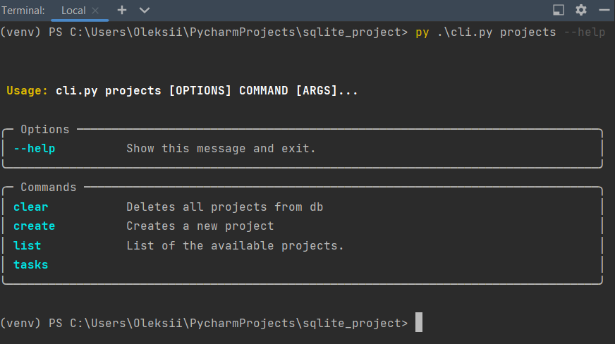
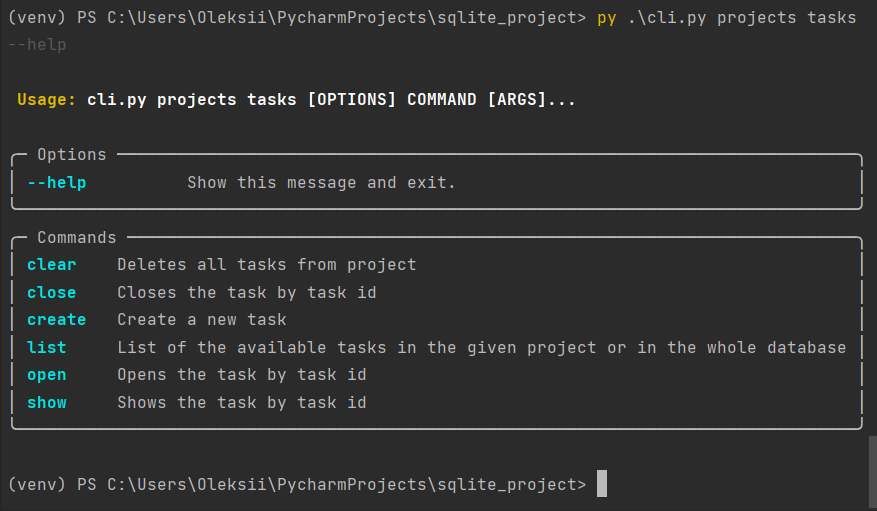
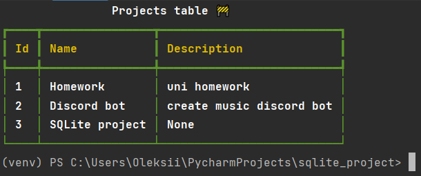
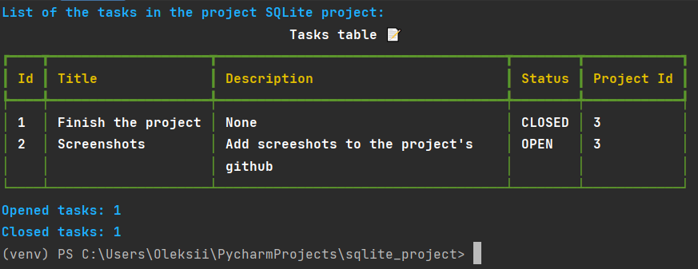

# sqlite_project
## Description
Simple todo app built with python to deomnstrate basics of sqlite python's module.
## Features
* Command line interface as the app's interface;
* Typer library for cli implementation;
* Rich library for enhancing cli appereance.
## Screnshots
#### Todo app commands list

#### Projects list 

#### SQLite project tasks list

